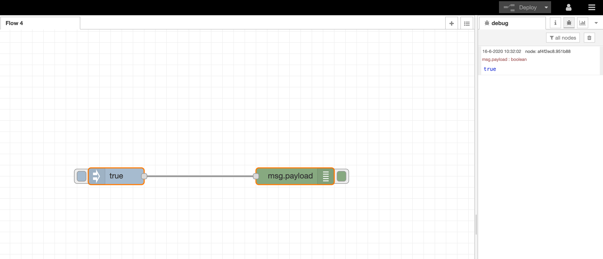

# Node-Red_API_Dashboard

This project is to understand how to use Node-Red as a dashboard and play around with several API's.
please follow the steps as decribed below.

1- create a Node-Red app using IBM Cloud. 
2- Deploy and run  the app and install nodes. 
3- create your first flow 
4- interact with API's. 
5 create a dashboard. 

1- Create a Node-Red app using IBM cloud. 
go to cloud.ibm.com and register for a new account. Once this is finished you can use the catalog and search for Node-Red. This will give you an app which you can use. There is a lite version which is free of charge. Please note that there is a limit of data transfer. Follow the steps to activate and deploy the app on IBM Cloud. 

2- Deploy and run  the app and install nodes. 
Once you have your Node-Red app running, you will see an App-URL in your dashboard. The first time you will need to set up a user-id and password or leave it blank (which is not recommended). Once you have completed the initial setup you will be redirected to your node-red environment. Take the time to explore the options and menu structure. 

3- Create your first flow. 
Node-Red uses "nodes"as building blocks which are displayed on the left side of the screen. You can drag and drop the nodes to your flow (middle section) and configure the nodes by double clicking. The right side of the screen provides you additional information such as an information screen, a debug window and other options. when selecting a node with a single click you can find information on how to use it on the right side of your screen under the "I"from information. 

to create a first flow you can use the "Inject"node by drag and drop this to your flow in the middle section of your screen. An "inject" node will give an output when clicking on the the little square at the right side of the node. When double clicking the node you can select the output which it will generate. there is a little drop-down option which enables a selection of using several formats like timestamt, number, string, boolean, Json etc. Selecting a Boolean "true" for example will provide a "true" statement on output which can be used to trigger a next node. 

If you want to see what the output of the node is you can use the "Debug" node by drag and drop this on to your Flow. Now connect the output of the "Inject" node, which is the right side, with the input of the "Debug" node by holding your mouse button. This will generate a wired connection. 

The last thing we need to do is activating our flow. This is being done by pressing the "deploy" button on the upper right side of the screen. This button will commit any changes and activate your flow. The "Deploy" button will color red when it detects a change in your flow. 

Select the debug windowon the right side (the little bug icon) to whow the output of your "Debug" node. Now press the inject node to inject a Boolean "True" statement. If its all done correctly a "true" statement will appear in the debug window on the right side of your screen. 

